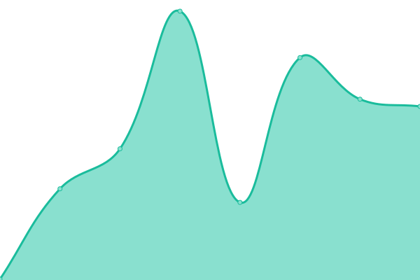
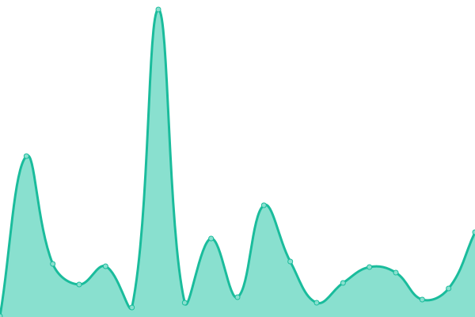

# [yoink status](https://status.yoink.tools)

<!--start: status pages-->
<!-- This summary is generated by Upptime (https://github.com/upptime/upptime) -->
<!-- Do not edit this manually, your changes will be overwritten -->
<!-- prettier-ignore -->
| URL | Status | History | Response time (ms) | Uptime |
| --- | ------ | ------- | ------------- | ------ |
|  [yoink.tools](https://yoink.tools) | 🟩 Up | [yoink-tools.yml](https://github.com/coah80/yoink-status/commits/HEAD/history/yoink-tools.yml) | 

 334ms
     
 | 

<a href="https://status.yoink.tools/history/yoink-tools">100.00%</a>
    

|  [yoink API](https://yoink.tools/health) | 🟩 Up | [yoink-api.yml](https://github.com/coah80/yoink-status/commits/HEAD/history/yoink-api.yml) | 

 50ms
     
 | 

<a href="https://status.yoink.tools/history/yoink-api">100.00%</a>
    

|  [yoink Discord Bot](https://yoink.tools/api/limits) | 🟩 Up | [yoink-discord-bot.yml](https://github.com/coah80/yoink-status/commits/HEAD/history/yoink-discord-bot.yml) | 

 49ms
     
 | 

<a href="https://status.yoink.tools/history/yoink-discord-bot">100.00%</a>
    

<!--end: status pages-->

[**Visit the status page →**](https://status.yoink.tools)

## Monitored Sites

- [yoink.tools](https://yoink.tools)
- [yoink API](https://yoink.tools/health)
- [yoink Discord Bot](https://yoink.tools/api/limits)

Powered by [Upptime](https://github.com/upptime/upptime).
